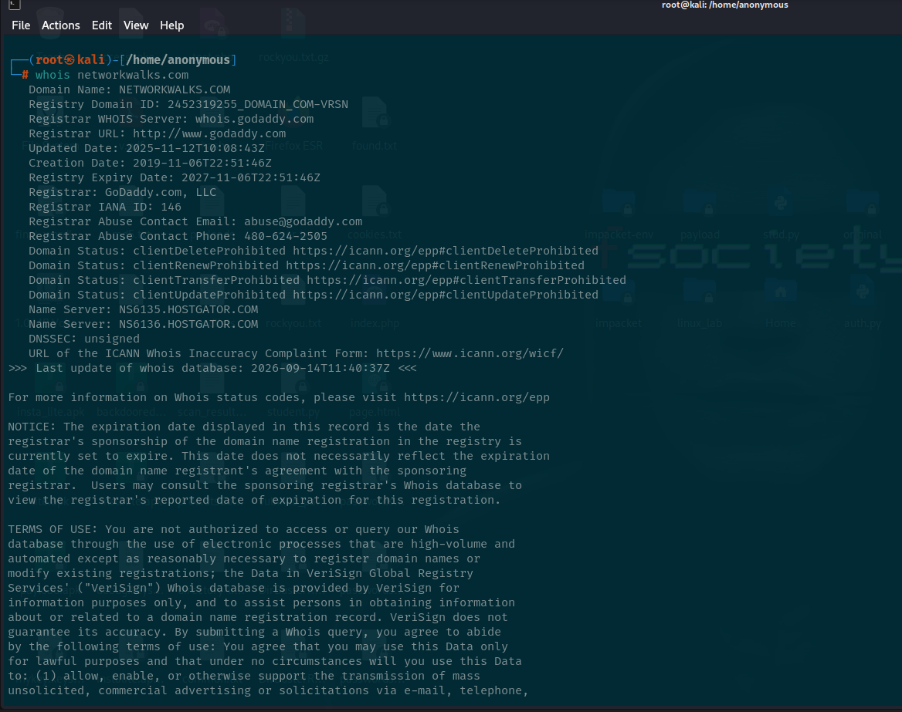
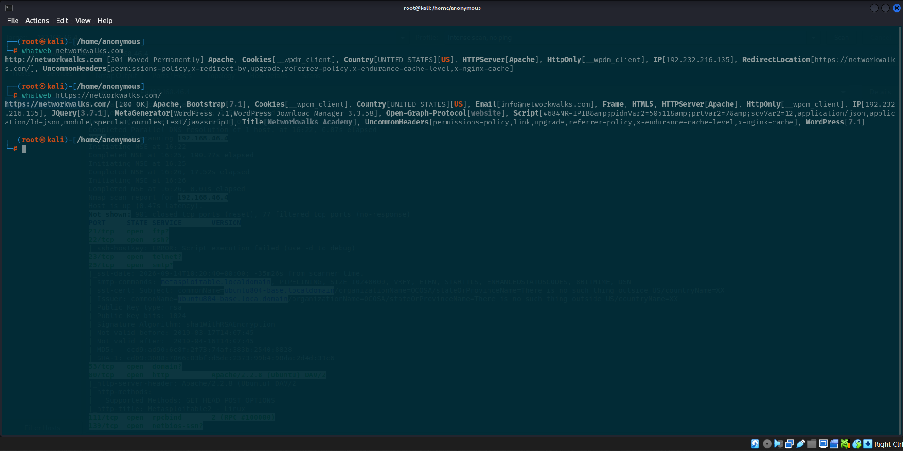
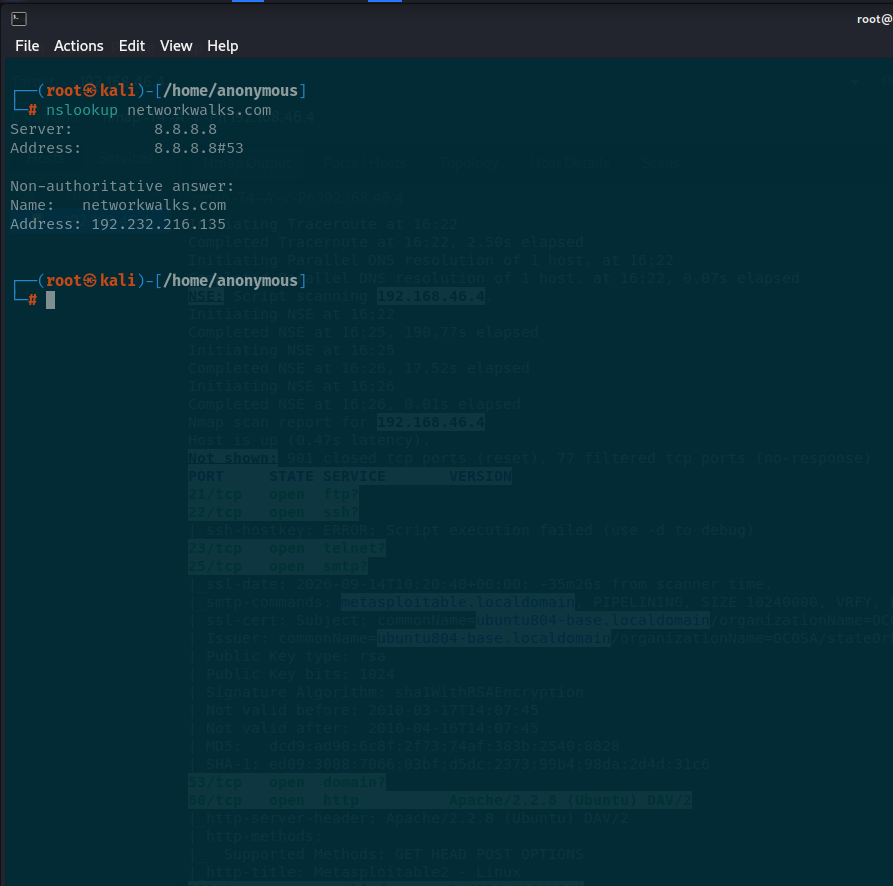
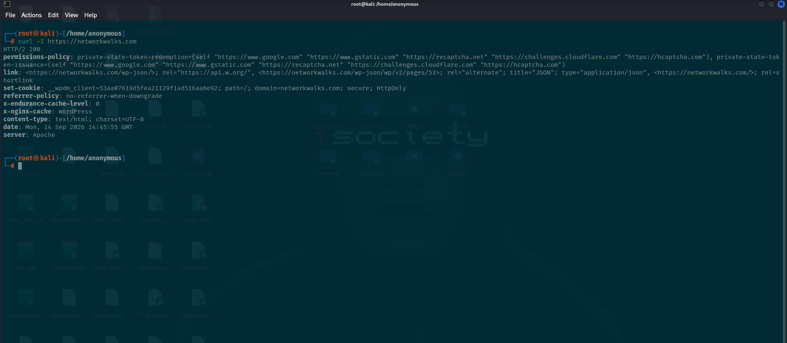
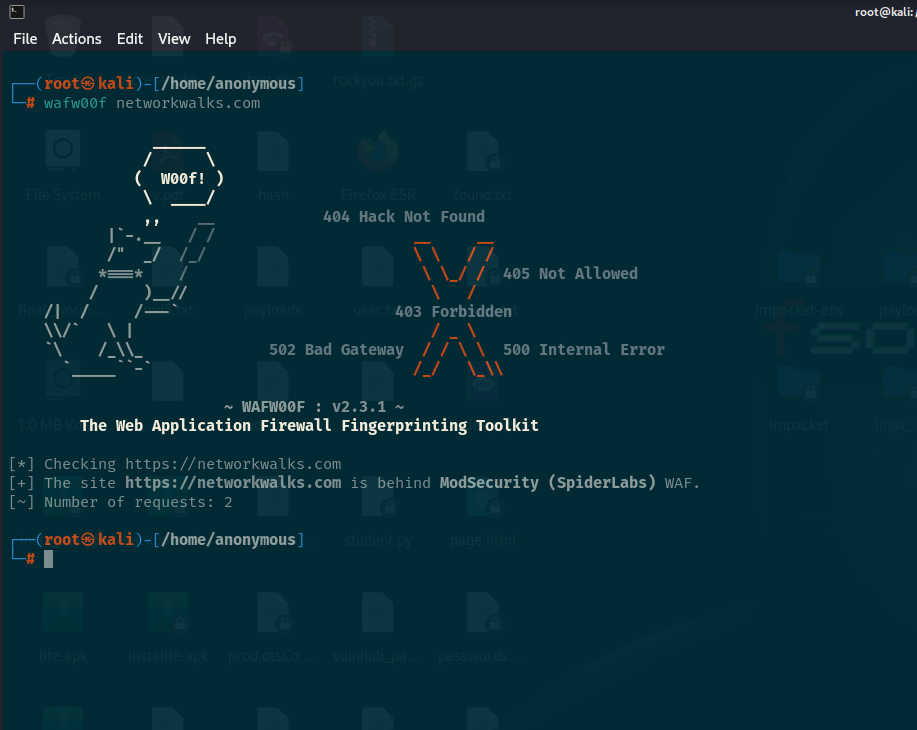
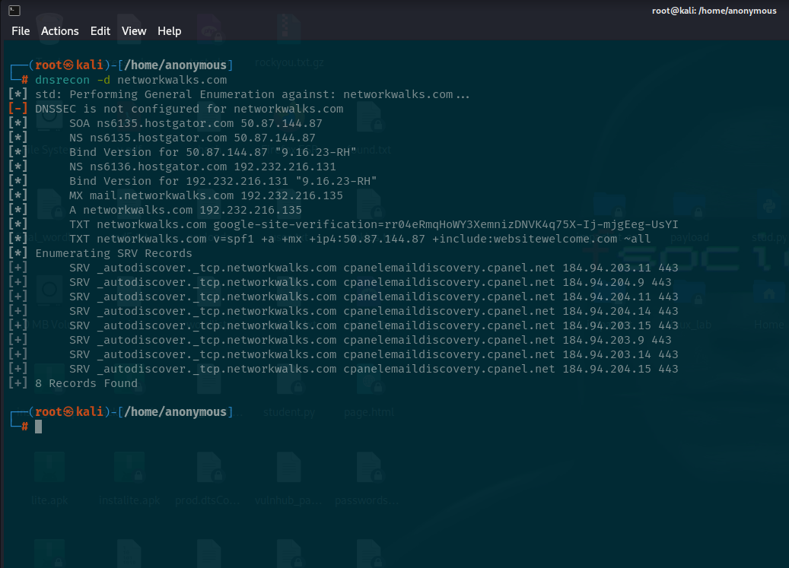

# Footprinting & Reconnaissance Attacks with Multiple Kali Tools (WK2-PM1)

In this lab, I learned to footprint the live website **networkwalks.com** using six built-in Kali Linux tools: `whois`, `whatweb`, `nslookup`, `curl`, `wafw00f`, and `dnsrecon`. Each tool reveals a different piece of the target, and together they build a full profile of it.

---

## 📌 Task 1 — whois

`whois` reveals the registrar, registration and expiry dates, and name servers. Here, the name servers point to HostGator, so an attacker instantly learns the hosting provider. Registration dates and abuse contacts help with social engineering and planning.

### Command
```bash
whois networkwalks.com
```

### Screenshot


### Output
```
┌──(root㉿kali)-[/home/anonymous]
└─# whois networkwalks.com
   Domain Name: NETWORKWALKS.COM
   Registry Domain ID: 2452319255_DOMAIN_COM-VRSN
   Registrar WHOIS Server: whois.godaddy.com
   Registrar URL: http://www.godaddy.com
   Updated Date: 2025-11-12T10:08:43Z
   Creation Date: 2019-11-06T22:51:46Z
   Registry Expiry Date: 2027-11-06T22:51:46Z
   Registrar: GoDaddy.com, LLC
   Registrar IANA ID: 146
   Registrar Abuse Contact Email: abuse@godaddy.com
   Registrar Abuse Contact Phone: 480-624-2505
   Domain Status: clientDeleteProhibited https://icann.org/epp#clientDeleteProhibited
   Domain Status: clientRenewProhibited https://icann.org/epp#clientRenewProhibited
   Domain Status: clientTransferProhibited https://icann.org/epp#clientTransferProhibited
   Domain Status: clientUpdateProhibited https://icann.org/epp#clientUpdateProhibited
   Name Server: NS6135.HOSTGATOR.COM
   Name Server: NS6136.HOSTGATOR.COM
   DNSSEC: unsigned
   URL of the ICANN Whois Inaccuracy Complaint Form: https://www.icann.org/wicf/
>>> Last update of whois database: 2026-09-14T11:40:37Z <<<

For more information on Whois status codes, please visit https://icann.org/epp

NOTICE: The expiration date displayed in this record is the date the
registrar's sponsorship of the domain name registration in the registry is
currently set to expire. This date does not necessarily reflect the expiration
date of the domain name registrant's agreement with the sponsoring
registrar. Users may consult the sponsoring registrar's Whois database to
view the registrar's reported date of expiration for this registration.

TERMS OF USE: You are not authorized to access or query our Whois
database through the use of electronic processes that are high-volume and
automated except as reasonably necessary to register domain names or
modify existing registrations; the Data in VeriSign Global Registry
Services' ("VeriSign") Whois database is provided by VeriSign for
information purposes only, and to assist persons in obtaining information
about or related to a domain name registration record. VeriSign does not
guarantee its accuracy. By submitting a Whois query, you agree to abide
by the following terms of use: You agree that you may use this Data only
for lawful purposes and that under no circumstances will you use this Data
to: (1) allow, enable, or otherwise support the transmission of mass
unsolicited, commercial advertising or solicitations via e-mail, telephone,
or facsimile; or (2) enable high volume, automated, electronic processes
that apply to VeriSign (or its computer systems). The compilation,
repackaging, dissemination or other use of this Data is expressly
prohibited without the prior written consent of VeriSign. You agree not to
use electronic processes that are automated and high-volume to access or
query the Whois database except as reasonably necessary to register
domain names or modify existing registrations. VeriSign reserves the right
to restrict your access to the Whois database in its sole discretion to ensure
operational stability. VeriSign may restrict or terminate your access to the
Whois database for failure to abide by these terms of use. VeriSign
reserves the right to modify these terms at any time.

The Registry database contains ONLY .COM, .NET, .EDU domains and
Registrars.
This WHOIS server is being retired. Please use our RDAP service instead. Rate limit exceeded. Try again after: 2562047h47m16.854775807s.
```

---

## 📌 Task 2 — whatweb

`whatweb` exposes the exact software and versions in use (here, WordPress 7.1 and WP Download Manager 3.3.58). An attacker can look these versions up in vulnerability databases to find known exploits. It also leaks the server IP and an email address.

### Command
```bash
whatweb networkwalks.com
```

### Screenshot


### Output
```
┌──(root㉿kali)-[/home/anonymous]
└─# whatweb networkwalks.com
http://networkwalks.com [301 Moved Permanently] Apache, Cookies[__wpdm_client], Country[UNITED STATES][US], HTTPServer[Apache], HttpOnly[__wpdm_client], IP[192.232.216.135], RedirectLocation[https://networkwalks.com/], UncommonHeaders[permissions-policy,x-redirect-by,upgrade,referrer-policy,x-endurance-cache-level,x-nginx-cache]

┌──(root㉿kali)-[/home/anonymous]
└─# whatweb https://networkwalks.com/
https://networkwalks.com/ [200 OK] Apache, Bootstrap[7.1], Cookies[__wpdm_client], Country[UNITED STATES][US], Email[info@networkwalks.com], Frame, HTML5, HTTPServer[Apache], HttpOnly[__wpdm_client], IP[192.232.216.135], JQuery[3.7.1], MetaGenerator[WordPress 7.1,WordPress Download Manager 3.3.58], Open-Graph-Protocol[website], Script[4684NR-IPIB&pidnVar2=50511&prtVar2=7&scvVar2=12,application/json,application/ld+json,module,speculationrules,text/javascript], Title[Networkwalks Academy], UncommonHeaders[permissions-policy,link,upgrade,referrer-policy,x-endurance-cache-level,x-nginx-cache], WordPress[7.1]
```

---

## 📌 Task 3 — nslookup

`nslookup` turns a domain name into its real IP address (192.232.216.135). Knowing the IP lets an
attacker scan the server directly, look up other sites on the same IP, and map the target's
infrastructure.

### Command
```bash
nslookup networkwalks.com
```

### Screenshot


### Output
```
┌──(root㉿kali)-[/home/anonymous]
└─# nslookup networkwalks.com
Server:         8.8.8.8
Address:        8.8.8.8#53

Non-authoritative answer:
Name:   networkwalks.com
Address: 192.232.216.135


```

---

## 📌 Task 4 — curl

HTTP headers leak the web server, caching stack and hidden endpoints (here the WordPress
REST API at /wp-json/). Attackers read headers to fingerprint the stack and find entry points
without even loading the full page.

### Command
```bash
curl -I https://networkwalks.com
```

### Screenshot


### Output
```
┌──(root㉿kali)-[/home/anonymous]
└─# curl -I https://networkwalks.com
HTTP/2 200 
permissions-policy: private-state-token-redemption=(self "https://www.google.com" "https://www.gstatic.com" "https://recaptcha.net" "https://challenges.cloudflare.com" "https://hcaptcha.com"), private-state-token-issuance=(self "https://www.google.com" "https://www.gstatic.com" "https://recaptcha.net" "https://challenges.cloudflare.com" "https://hcaptcha.com")
link: <https://networkwalks.com/wp-json/>; rel="https://api.w.org/", <https://networkwalks.com/wp-json/wp/v2/pages/53>; rel="alternate"; title="JSON"; type="application/json", <https://networkwalks.com/>; rel=shortlink
set-cookie: __wpdm_client=53aa07619d5fea21129f14d516aa6e92; path=/; domain=networkwalks.com; secure; HttpOnly
referrer-policy: no-referrer-when-downgrade
x-endurance-cache-level: 0
x-nginx-cache: WordPress
content-type: text/html; charset=UTF-8
date: Mon, 14 Sep 2026 14:45:55 GMT
server: Apache

```

---

## 📌 Task 5 — wafw00f

`wafw00f` tells an attacker if a firewall is watching. Here the site sits behind ModSecurity
(SpiderLabs). Knowing a WAF is present shapes the whole attack: naive attempts will be blocked
or logged, so the attacker must adapt or try to bypass it.

### Command
```bash
wafw00f networkwalks.com
```

### Screenshot


### Output
```
┌──(root㉿kali)-[/home/anonymous]
└─# wafw00f networkwalks.com

                ______
               /      \
              (  W00f! )
               \  ____/
               ,,    __            404 Hack Not Found
           |`-.__   / /                      __     __
           /"  _/  /_/                       \ \   / /
          *===*    /                          \ \_/ /  405 Not Allowed
         /     )__//                           \   /
    /|  /     /---`                        403 Forbidden
    \\/`   \ |                                 / _ \
    `\    /_\\_              502 Bad Gateway  / / \ \  500 Internal Error
      `_____``-`                             /_/   \_\\

                        ~ WAFW00F : v2.3.1 ~
        The Web Application Firewall Fingerprinting Toolkit
    
[*] Checking https://networkwalks.com
[+] The site https://networkwalks.com is behind ModSecurity (SpiderLabs) WAF.
[~] Number of requests: 2


```

---

## 📌 Task 6 — dnsrecon

`dnsrecon` maps the target's entire DNS footprint: mail servers, DNS software version (Bind
9.16.23), SPF policy and cPanel service records. Each record is a potential foothold and helps an
attacker understand the email and hosting setup.

### Command
```bash
dnsrecon -d networkwalks.com
```

### Screenshot


### Output
```
┌──(root㉿kali)-[/home/anonymous]
└─# dnsrecon -d networkwalks.com
[*] std: Performing General Enumeration against: networkwalks.com...
[-] DNSSEC is not configured for networkwalks.com
[*]      SOA ns6135.hostgator.com 50.87.144.87
[*]      NS ns6135.hostgator.com 50.87.144.87
[*]      Bind Version for 50.87.144.87 "9.16.23-RH"
[*]      NS ns6136.hostgator.com 192.232.216.131
[*]      Bind Version for 192.232.216.131 "9.16.23-RH"
[*]      MX mail.networkwalks.com 192.232.216.135
[*]      A networkwalks.com 192.232.216.135
[*]      TXT networkwalks.com google-site-verification=rr04eRmqHoWY3XemnizDNVK4q75X-Ij-mjgEeg-UsYI
[*]      TXT networkwalks.com v=spf1 +a +mx +ip4:50.87.144.87 +include:websitewelcome.com ~all
[*] Enumerating SRV Records
[+]      SRV _autodiscover._tcp.networkwalks.com cpanelemaildiscovery.cpanel.net 184.94.203.11 443
[+]      SRV _autodiscover._tcp.networkwalks.com cpanelemaildiscovery.cpanel.net 184.94.204.9 443
[+]      SRV _autodiscover._tcp.networkwalks.com cpanelemaildiscovery.cpanel.net 184.94.204.11 443
[+]      SRV _autodiscover._tcp.networkwalks.com cpanelemaildiscovery.cpanel.net 184.94.204.14 443
[+]      SRV _autodiscover._tcp.networkwalks.com cpanelemaildiscovery.cpanel.net 184.94.203.15 443
[+]      SRV _autodiscover._tcp.networkwalks.com cpanelemaildiscovery.cpanel.net 184.94.203.9 443
[+]      SRV _autodiscover._tcp.networkwalks.com cpanelemaildiscovery.cpanel.net 184.94.203.14 443
[+]      SRV _autodiscover._tcp.networkwalks.com cpanelemaildiscovery.cpanel.net 184.94.204.15 443
[+] 8 Records Found


```

---