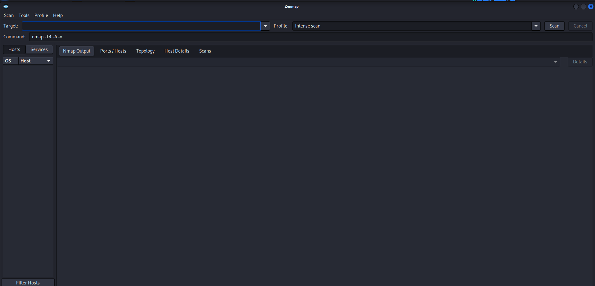
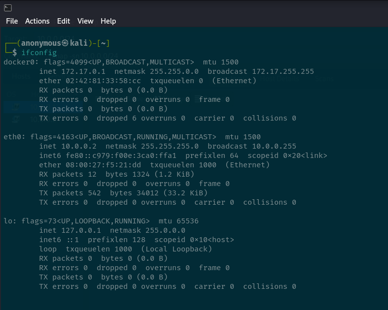
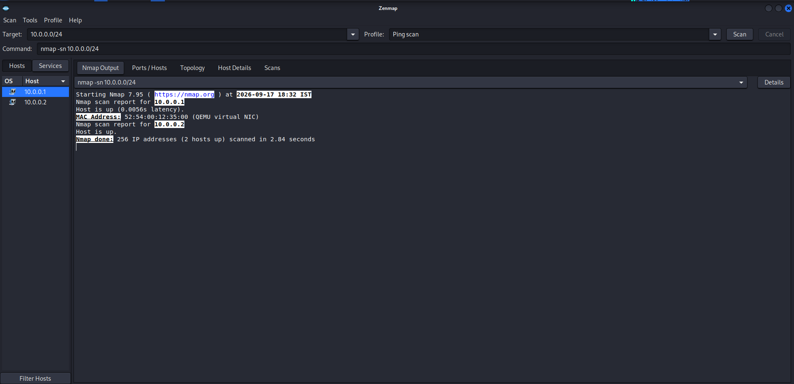
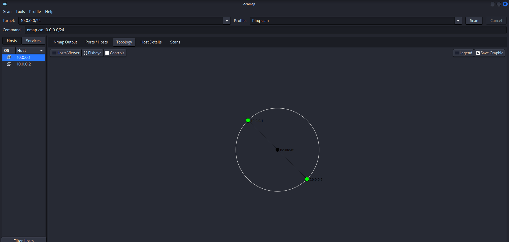

# Network Scanning with Zenmap (WK2-PM5)

In this lab, I used **Zenmap**, the official GUI version of Nmap for Windows, to discover live hosts on my local LAN subnet, identify their IP and MAC addresses, and export the scan results as a network topology diagram.

---

## Background

Zenmap is a security scanner tool used by cybersecurity professionals and hackers. It is a multi-platform (Linux, Windows, macOS, BSD) free and open-source application that makes Nmap easy for beginners while still providing advanced features for experienced users. Frequently used scans can be saved as profiles for easy reuse.

---

## 📌 Task 1 — Install Zenmap

Downloaded and installed Zenmap from the official Nmap website on Windows.

**Source:** https://nmap.org/download.html

### Steps
1. Downloaded the Windows installer (`nmap-7.91-setup.exe`) from the Nmap downloads page.
2. Ran the setup file, accepted the license agreement, and kept the default components (Nmap Core Files, Npcap, Zenmap GUI Frontend, Ndiff, Ncat, Nping).
3. Chose the default install location and clicked **Install**.
4. Completed the Npcap driver installation step.
5. Clicked **Finish** and launched Zenmap from the desktop shortcut.

### Screenshot


---

## 📌 Task 2 — Find local IP address & LAN subnet

Opened Command Prompt and ran `ifconfig` to find the local IP address and subnet mask.

### Command
```bash
ifconfig
```

### Result
- **IPv4 Address:** 10.0.0.2
- **Subnet Mask:** 255.255.255.0
- **Subnet:** 10.0.0.0/24

### Screenshot


---

## 📌 Task 3 — Find live hosts in the subnet

Opened Zenmap, entered the local subnet as the target, selected the **Ping scan** profile, and ran the scan.

### Command
```bash
nmap -sn 10.0.0.0/24
```

### Output
```
Starting Nmap 7.95 ( https://nmap.org ) at 2026-09-17 18:32 IST
Nmap scan report for 10.0.0.1
Host is up (0.0056s latency).
MAC Address: 52:54:00:12:35:00 (QEMU virtual NIC)
Nmap scan report for 10.0.0.2
Host is up.
Nmap done: 256 IP addresses (2 hosts up) scanned in 2.84 seconds

```

### Screenshot


---

## 📌 Task 4 — How many hosts are live?

**Answer:** 2 hosts are live (including my own PC).

---

## 📌 Task 5 — IP addresses of the live hosts

**Answer:**
- 10.0.0.1
- 10.0.0.2

---

## 📌 Task 6 — MAC addresses of the live hosts

**Answer:**
- 52:54:00:12:35:00
- 08:00:27:f5:21:dd *(local PC's own MAC, found via `ip link`)*

---

## 📌 Task 7 — Display & save the output topology as PDF

Clicked the **Topology** tab, enabled the legend to interpret the host icons, then clicked **Save Graphic** and exported the diagram as a PDF to the desktop.

### Steps
1. In Zenmap, switched to the **Topology** tab.
2. Clicked **Legend** to review host/connection icon meanings.
3. Clicked **Save Graphic**, selected **PDF** as the file type, and saved it to the desktop.

### Screenshot


---

## Reference

Lab questions answered on: https://networkwalks.com/zenmap-network-scanning-practice-lab/
